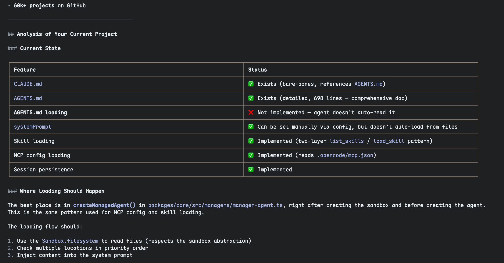
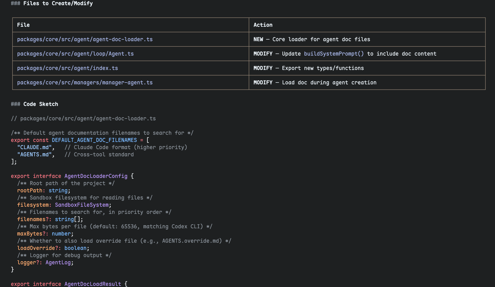

# ink-stream-markdown

[](https://www.npmjs.com/package/ink-stream-markdown)
[](https://www.npmjs.com/package/ink-stream-markdown)

A streaming markdown renderer for [Ink](https://github.com/vadimdemedes/ink). Parses markdown with [stream-markdown-parser](https://github.com/nicepkg/stream-markdown-parser), highlights code blocks with [Shiki](https://shiki.style), and renders styled output to the terminal.

| Markdown rendering                    | Syntax highlighting                  |
| ------------------------------------- | ------------------------------------ |
|  |  |

## Install

```bash
npm install ink-stream-markdown ink react
# or
pnpm add ink-stream-markdown ink react
```

`ink` and `react` are peer dependencies.

## Quick Start

```tsx
import { render } from 'ink'
import { StreamMarkdown, initHighlighter } from 'ink-stream-markdown'

// Initialize Shiki before first render (loads syntax grammars)
await initHighlighter()

function App() {
  const md = `
# Hello World

Here is some **bold** and *italic* text with \`inline code\`.

\`\`\`typescript
const greeting = 'Hello from ink-stream-markdown!'
console.log(greeting)
\`\`\`
  `

  return <StreamMarkdown>{md}</StreamMarkdown>
}

render(<App />)
```

## Streaming Usage

The component works naturally with streaming content — just pass the growing string as it arrives:

```tsx
import { useState, useEffect } from 'react'
import { render } from 'ink'
import { StreamMarkdown, initHighlighter } from 'ink-stream-markdown'

function StreamingApp() {
  const [content, setContent] = useState('')

  useEffect(() => {
    // Append chunks as they arrive from an LLM, API, etc.
    someStream.on('data', (chunk) => {
      setContent((prev) => prev + chunk)
    })
  }, [])

  return <StreamMarkdown>{content}</StreamMarkdown>
}

await initHighlighter()
render(<StreamingApp />)
```

## Props

| Prop            | Type                 | Description                                                             |
| --------------- | -------------------- | ----------------------------------------------------------------------- |
| `children`      | `string`             | Markdown content to render                                              |
| `theme`         | `ThemeOptions`       | Style overrides (colors, renderers, width, table options)               |
| `highlight`     | `HighlightOptions`   | Custom code highlighting pipeline (tokenization and/or token rendering) |
| `parserOptions` | `GetMarkdownOptions` | markdown-it instance options (plugins, math, containers, etc.)          |
| `parseOptions`  | `ParseOptions`       | Per-parse options (token transforms, link validation, etc.)             |

## Theming

The default theme uses a GitHub dark mode color palette. Override any style with a chalk function:

```tsx
import chalk from 'chalk'
import { StreamMarkdown } from 'ink-stream-markdown'
;<StreamMarkdown
  theme={{
    heading: chalk.red.bold,
    code: chalk.cyan,
    link: chalk.green.underline,
    width: 100,
  }}
>
  {md}
</StreamMarkdown>
```

### Available Theme Keys

**Text styles** — `text`, `heading`, `firstHeading`, `link`, `href`, `strong`, `em`, `del`, `code`, `codeBlock`, `blockquote`, `listItem`, `hr`, `html`, `table`, `mark`

**Semantic colors** — `muted`, `border`, `success`, `warning`, `error`, `info`, `purple`

**Layout** — `width` (terminal width override, defaults to `process.stdout.columns`), `tableOptions` (table rendering options, see below)

**Renderers** — `renderers` (custom render functions per node type, see below)

**Highlight** — `highlight` (custom code highlighting pipeline, see below)

### Table Options

Fine-tune table rendering via `theme.tableOptions`:

```tsx
<StreamMarkdown
  theme={{
    tableOptions: {
      minColumnWidth: 8,
      cellPadding: 2,
      rowSeparator: false,
      borderChars: {
        topLeft: '╭', topRight: '╮',
        bottomLeft: '╰', bottomRight: '╯',
        horizontal: '─', vertical: '│',
        teeDown: '┬', teeUp: '┴',
        teeRight: '├', teeLeft: '┤',
        cross: '┼',
      },
    },
  }}
>
  {md}
</StreamMarkdown>
```

| Option           | Type               | Default | Description                                        |
| ---------------- | ------------------ | ------- | -------------------------------------------------- |
| `minColumnWidth` | `number`           | `5`     | Minimum column width before hard-wrapping words     |
| `cellPadding`    | `number`           | `1`     | Spaces on each side of cell content                 |
| `rowSeparator`   | `boolean`          | `true`  | Draw horizontal lines between body rows             |
| `borderChars`    | `TableBorderChars` | —       | Override box-drawing characters (e.g. rounded corners) |

## Custom Renderers

Override how any node type is rendered without forking the whole renderer:

```tsx
import { StreamMarkdown, defaultRenderers } from 'ink-stream-markdown'
import type { NodeRenderer } from 'ink-stream-markdown'

// Wrap the default code block renderer with a custom border
const myCodeBlock: NodeRenderer = (node, ctx, renderChildren) => {
  const original = defaultRenderers.code_block!(node, ctx, renderChildren)
  return '┌──────────\n' + original + '\n└──────────'
}

// Replace heading rendering entirely
const myHeading: NodeRenderer = (node, ctx, renderChildren) => {
  const text = renderChildren(node.children, ctx)
  return `>>> ${text} <<<`
}

;<StreamMarkdown
  theme={{ renderers: { code_block: myCodeBlock, heading: myHeading } }}
>
  {md}
</StreamMarkdown>
```

Every renderer receives three arguments:

| Argument         | Type                        | Description                                    |
| ---------------- | --------------------------- | ---------------------------------------------- |
| `node`           | `ParsedNode`                | The parsed markdown AST node                   |
| `ctx`            | `RenderContext`             | Rendering context with `theme` and `listDepth` |
| `renderChildren` | `(children, ctx) => string` | Helper to render child nodes                   |

The `defaultRenderers` map is exported so you can compose on top of built-in behavior.

## Custom Highlight Pipeline

The default highlighting uses [Shiki](https://shiki.style) for tokenization and chalk for coloring. You can replace the entire pipeline with any highlighter by providing a single `highlightCode` callback that takes source code and a language and returns a styled string:

```tsx
import { StreamMarkdown, defaultHighlightCode } from 'ink-stream-markdown'

// Use highlight.js instead of Shiki
<StreamMarkdown
  highlight={{
    highlightCode: (code, lang) => hljs.highlight(code, { language: lang }).value,
  }}
>
  {md}
</StreamMarkdown>

// Wrap the default Shiki pipeline with custom logic
<StreamMarkdown
  highlight={{
    highlightCode: (code, lang) => {
      const highlighted = defaultHighlightCode(code, lang)
      return '>>>\n' + highlighted + '\n<<<'
    },
  }}
>
  {md}
</StreamMarkdown>
```

| Option          | Type                                              | Description                                                                       |
| --------------- | ------------------------------------------------- | --------------------------------------------------------------------------------- |
| `highlightCode` | `(code: string, lang: string) => string`          | Replace the code-to-styled-string pipeline (default: Shiki + chalk)               |
| `renderMermaid` | `((code: string) => string) \| false` | Custom mermaid renderer, or `false` to disable (default: beautiful-mermaid ASCII) |

`defaultHighlightCode` is exported so you can compose custom logic on top of the built-in Shiki pipeline.

## Parser Options

Configure the underlying markdown-it parser:

```tsx
<StreamMarkdown
  parserOptions={{
    enableMath: true,
    enableContainers: true,
    customHtmlTags: ['thinking'],
  }}
  parseOptions={{
    final: true,
    validateLink: (url) => !url.startsWith('javascript:'),
  }}
>
  {md}
</StreamMarkdown>
```

## Programmatic API

Use the parser and renderer independently outside of React/Ink:

```typescript
import {
  parseMarkdown,
  createParser,
  renderNodesToString,
  renderNodeToString,
  initHighlighter,
  resolveTheme,
} from 'ink-stream-markdown'

await initHighlighter()

// One-shot parse + render
const nodes = parseMarkdown('# Hello **world**')
const output = renderNodesToString(nodes)
console.log(output)

// With custom theme
const output2 = renderNodesToString(nodes, { code: chalk.cyan })

// Reusable parser instance
const parser = createParser({ enableMath: true })
const nodes2 = parser.parse('$E = mc^2$')
```

## Browser Usage (ink-web)

This package provides a web-compatible entry point for use with [ink-web](https://github.com/cjroth/ink-web), which renders Ink components into an xterm.js terminal in the browser.

```bash
npm install ink-stream-markdown ink-web react
```

Import from `ink-stream-markdown/web` instead of `ink-stream-markdown`:

```tsx
import { StreamMarkdown, initHighlighter } from 'ink-stream-markdown/web'
```

The web entry swaps terminal-specific dependencies with browser-compatible shims:

- **Shiki** uses `shiki/bundle/web` (loads grammars via fetch instead of fs)
- **Links** use OSC 8 escape sequences (supported by xterm.js) instead of `terminal-link`
- **Terminal width** defaults to `80` (override via `theme.width`)

### Vite Setup

Use `ink-web`'s Vite plugin and alias `ink` to `ink-web`:

```typescript
import { defineConfig } from 'vite'
import react from '@vitejs/plugin-react'
import { inkWebPlugin } from 'ink-web/vite'

export default defineConfig({
  plugins: [react(), inkWebPlugin()],
  resolve: {
    alias: { ink: 'ink-web' },
  },
})
```

### Next.js / Webpack Setup

Alias `ink` to `ink-web` so Webpack resolves the web-compatible renderer:

```javascript
/** @type {import('next').NextConfig} */
const config = {
  webpack: (config) => {
    config.resolve.alias = {
      ...config.resolve.alias,
      ink: 'ink-web',
    }
    return config
  },
}

export default config
```

For a standalone webpack config:

```javascript
module.exports = {
  resolve: {
    alias: { ink: 'ink-web' },
  },
}
```

## Supported Markdown Features

- Headings (h1–h6)
- Paragraphs, bold, italic, strikethrough
- Inline code and fenced code blocks (with Shiki syntax highlighting)
- Ordered and unordered lists (with nesting)
- Blockquotes
- Tables
- Links (clickable in supported terminals via [terminal-link](https://github.com/sindresorhus/terminal-link))
- Images (rendered as `[Image: alt]`)
- Horizontal rules
- Checkboxes
- Footnotes and footnote references
- Definition lists
- Admonitions (note, tip, warning, caution, etc.)
- Math (inline and block)
- Highlight, insert, subscript, superscript
- Emoji shortcodes
- HTML blocks and inline HTML
- Custom HTML-like components

## License

MIT
